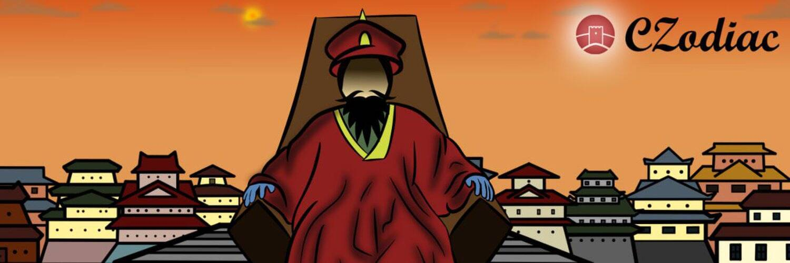

CZodiac 是一个基于 BSC 的 defi、nft 和游戏平台。它使用 multidex LP 农业系统，允许用户通过存入 LP 来赚取通货膨胀的 CZFarm (CZF)。 CZodiac 还提供反倾销保险库，用户可以通过将资产锁定到其他农业平台来赚取 CZF。用户可以将他们的 CZF 质押到池中，以从合作伙伴那里获得代币并获得反倾销金库收益。 CZF 也可以锁定为支持 CZUSD（CZodiac 的稳定币）的债务。除了超额抵押债务外，CZUSD 还通过经济中立的算法再平衡来维持其挂钩。 CZodiac 还提供一系列 CZodiac 反射代币，这些代币会定期交换到下一个 Zodiac。这些代币对于 CZodiac 的 Hunt 游戏至关重要，玩家可以锁定他们的 Zodiac 代币以参与游戏。 Hunt 游戏的获胜者将获得提供农业收益的 NFT。

