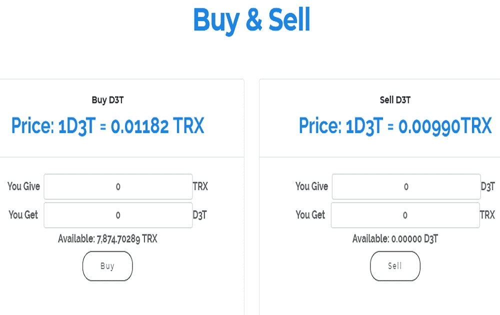

D3T 开始时间：UTC 2019/3/5 14:00:00 首个 D3T 代币价格 = 0.01182 trx 智能合约开源，无预挖，一切安全公平每次在交易所买卖的股息。 D3T 代币是 TRC-20 代币，每个代币的价格由智能合约决定。只要您持有 D3T 代币，您就可以从买卖以及所有当前和未来的游戏中不断积累红利。 D3T 开始时间：UTC 2019/3/5 14:00:00 第一个 D3T 代币的价格 = 0.01182 trx 智能合约已经公开，没有预挖，一切都是安全和公平的 D3T 是一种特殊的加密货币交换，D3T是TRC-20，您在代币的交易中获得了红利，您在代币的价格由智能合约决定。销售以及所有当前和未来游戏的红利。

