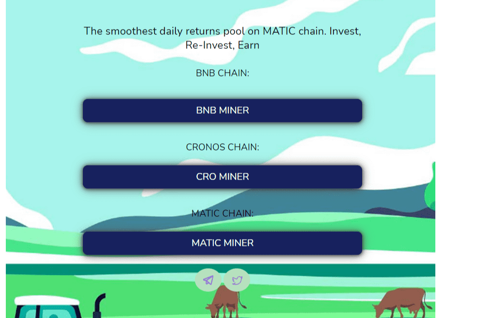

一个分散的矿工奖励池 dApp 建立在三个有前途的网络 - Binance Smart Chain、Polygon 和 Cronos 之上，它为用户提供了以简单性获得财务自由的机会。当您看到您的代币每天都在增长时，尽情享受吧！
DailyFarm 特点
年利率
每天高达 8% (2920%)
推荐人
使用您的推荐链接从任何人那里获得 12% 的 BNB/CRO/MATIC 投资。
费用
3% 开发者投资和提现费，无再投资费。
链条：
BSC、多边形、克罗诺斯

