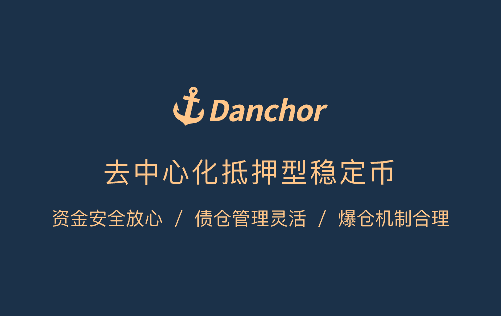

Danchor 是一个基于 EOS 的去中心化 Staking 稳定币项目，支持用户通过 Staking EOS 生成稳定币 USN（1:1 挂钩 USD）。

Danchor是基于EOS的去中心化常规型稳定币，支持用户常驻EOS发行币USN（1：1项目定美元）。 系统通过超额稳定与爆仓均衡的控制机制，有效规避市场波动，确保有足额全国物为每个USN提供价值中心。基于合约的智能运行，信息公开透明，数据在发布链上可实时查询。常说USN，可满足流通交易、获取流动资金等对外金融交易的需求。

