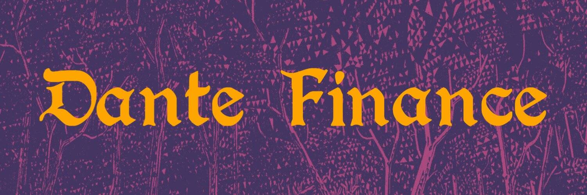

未来用例
Dante Finance 是 Tomb Finance 的一个分支，因此我们决定支持它，将 $DANTE 与 $TOMB 挂钩
DANTE 是一种与 TOMB 挂钩的算法代币。该协议的底层机制动态调整 DANTE 供应量，使其价格相对于 TOMB 的价格上涨或下跌。
Dante Finance 是一个多代币协议，由以下三个代币组成：-Dante ($DANTE)。 -但丁股票 ($GRAIL) -但丁债券 ($DBOND)
我们不仅仅是一个墓叉，我们想为 $DANTE 构建一个完整的生态系统！

