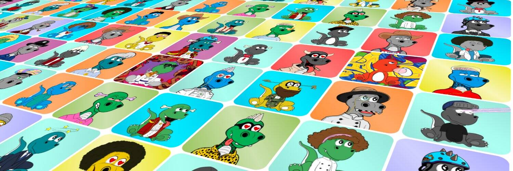

如果我们都记得所有的恐龙都是衣冠楚楚的，那么恐龙就不会灭绝。然而，某些恐龙比其他恐龙更精致。恐龙的衣冠楚楚从 DAPPER 到 DASHING。这些类别取决于您的 Dapper Dino 由哪些项目组成。在 Dappernomics 规模上，围巾等 DAPPER 物品的价值低于潜水帽或猎豹运动服等更多 DASHING 物品。

Dapper Dinos 是一个适合家庭的 NFT 项目，由 9,999 个以编程方式随机生成的恐龙组成，这些恐龙生活在以太坊区块链上。

我们的使命是让持有者独家访问体验、商品、社区驱动的活动、慈善事业，以及首创的元宇宙，让持有者能够互相玩耍、赚钱和互动。

