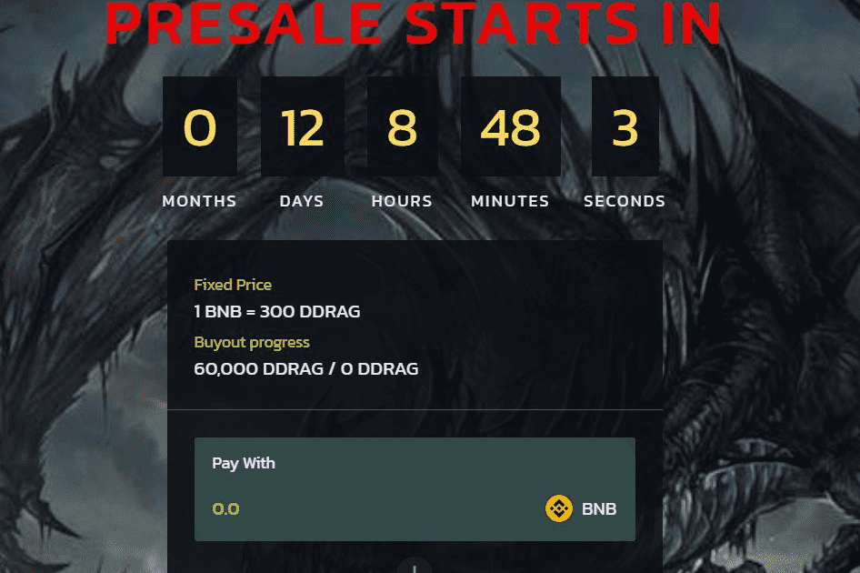

BSC最高APRS上的最佳DEX

由一群经验丰富的企业家和运营商组成的私募股权公司，拥有成功的投资记录。我们对科技公司进行有控制的投资，重点关注促进多样性和提供有吸引力的回报的历史。

A。员工多元化：截至 2021 年 11 月，75% 的 BDC 员工是多元化的。
B。平均运营经验：截至 2021 年 11 月，BDC 交易团队的平均运营经验为 27 年。
C。企业价值：从 2018 年 3 月到 2021 年 9 月，我们投资组合的企业价值绝对值增长了 715%，复合平均增长了 82%

