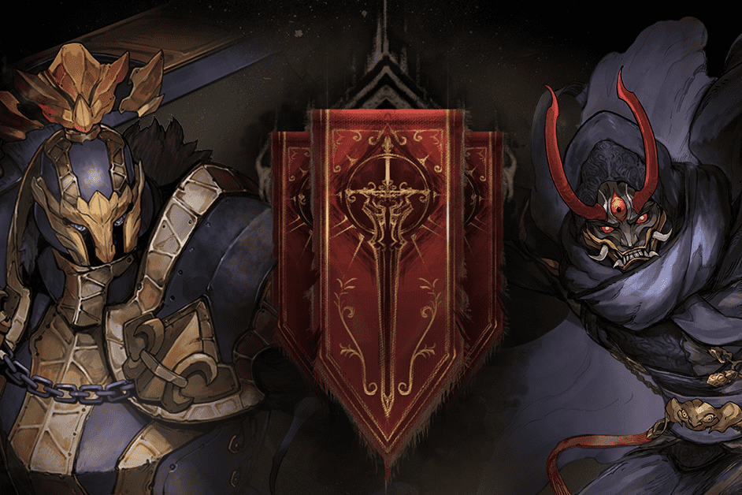

Dark Empire 是一款基于 Polygon 的在线多人区块链游戏，具有 PVP、PVE、团队对战游戏模式。
🕹关于游戏🕹
✔️多人区块链游戏
✔️ 黑暗英雄和黑暗野兽
✔️ 单人、团队、挑战
✔️ 玩家可以成为游戏内商人
✔️ 顶级玩家的每周奖励
✔️中/英文版
✔️ 将包括 PayPal 付款，以便初学者可以加入游戏
✔️ 没有购买角色的观众也可以通过质押参与游戏
✔️ 近期将与高等级玩家分享收益
✔️ 未来会推出手机版
✅ 准备好玩了

