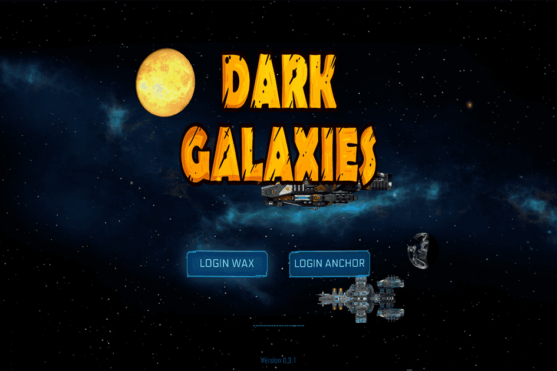

2028年，人类在历经动荡和纷争之后终于实现了世界统一。在经历了前所未有的全球反叛时代之后，人类设法摆脱了过去的伤痕，转向更伟大的事物。到 2032 年，人类完成了他们的第一个空间站。这是地球上每个国家的巨大成就，他们终于意识到，当每个人共同努力追求更好的物种时，可以取得什么成就。到 2036 年，人类现在已经超越了地球并在星际航行。

经过管家的探索，人类很快就开始接触到几种生命。他们学习和交易知识，并利用从许多其他外来物种那里获得的知识进一步成长。

随着人类进一步冒险到太空的外围，很快就发现他们需要殖民更多如此生存和存在的行星，超出地球的限制。

他们很快发现，他们并不是唯一试图在新的家园世界繁衍的物种，并发现自己与其他种族发生冲突。

