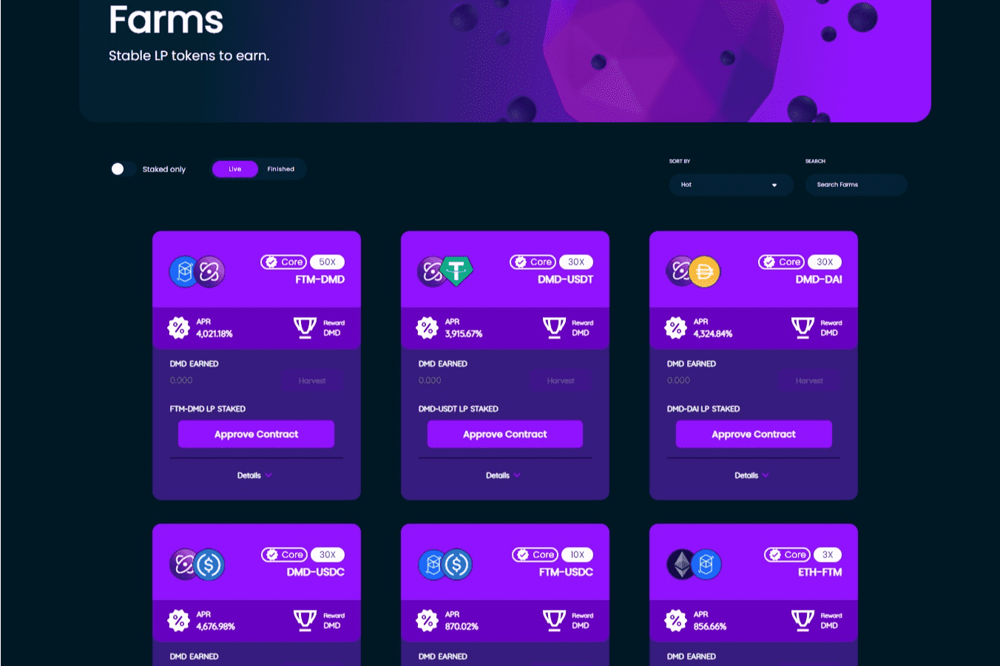

创始人代币

Founders Token (FT) 是我们授予早期采用者、社区成员、志愿者和团队成员的第一个暗物质 NFT。代币被分发，它们在发布前的比赛中获胜，或者它们被给予购买最大买入量的预售参与者。

  
Founders Tokens 可以质押到特殊的池中以获得额外的 DMD！ Founders Tokens (FT) 让持有者可以访问私人电报群聊。持有 FT 为用户提供了对竞赛、空投等的独家访问权限！

