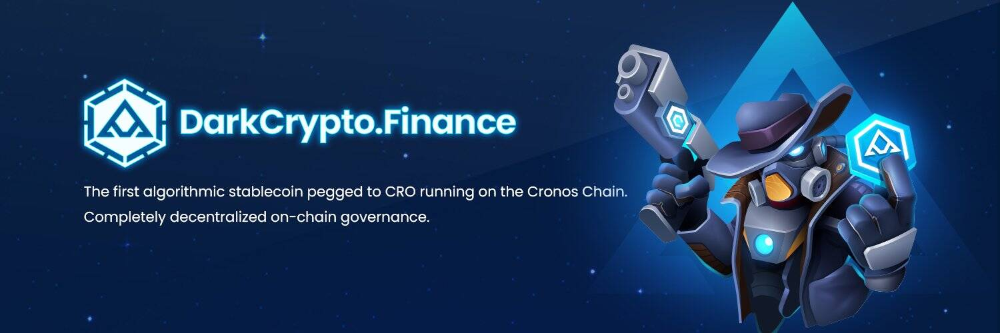

DarkNess Dollar 是一种稳定币，其部分供应由抵押品和部分供应算法支持。这意味着 DarkNess Dollar 是一种稳定币，其部分供应浮动/无担保。
抵押和算法的比率取决于市场对 DarkNess Dollar 稳定币 - DUSD 的定价。如果 DUSD 的交易价格高于 1 美元，则协议会降低抵押品比率。如果 DUSD 的交易价格低于 1 美元，则协议会增加抵押品比率。
DarkNess Dollar 试图成为 Cronos 链上第一个实现完全抵押和纯算法稳定币设计原则的稳定币协议。我们的目标是创造一种高度可扩展、可信赖、极其稳定且意识形态纯正的链上货币。

