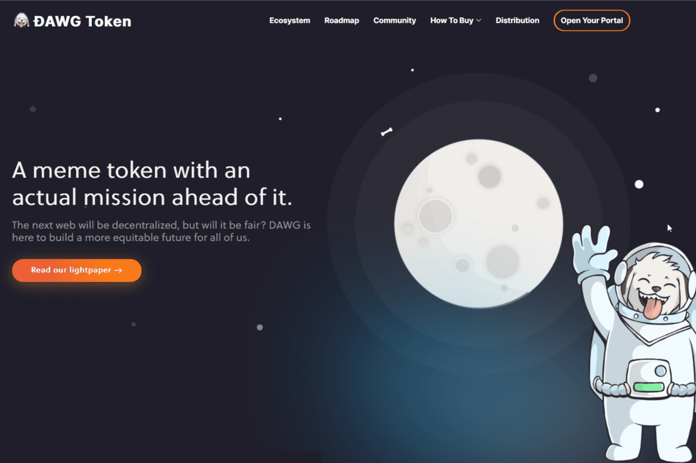

---
title: "DAWG"
description: "DAWG 正在构建一个实验性生态系统，将 web2 用户迁移到 web3，并通过解耦的 dApp 将权力交还给他们。"
date: 2022-08-15T00:00:00+08:00
lastmod: 2022-08-15T00:00:00+08:00
draft: false
authors: ["boogArno"]
featuredImage: "dawg.png"
tags: ["High risk","DAWG"]
categories: ["nfts"]
nfts: ["High risk"]
blockchain: "BSC"
website: "https://dappradar.com/deeplink/7969"
twitter: "https://twitter.com/inumakidawg"
discord: "https://discord.com/invite/qTENySSbMT"
telegram: "https://t.me/inumakidawg"
github: "https://github.com/inumakidawg"
youtube: ""
twitch: ""
facebook: "https://facebook.com/inumakidawg"
instagram: "https://instagram.com/inumakidawg"
reddit: "https://www.reddit.com/r/inumaki/"
medium: "https://medium.com/@inumaki"
steam: ""
gitbook: ""
googleplay: ""
appstore: ""
status: "Live"
weight: 
lightgallery: true
toc: true
pinned: false
recommend: false
recommend1: false
---
我们不是软件的反映，但软件是我们的反映——使用它的人。模因也是如此，文化也是如此，电子游戏也是如此。
DAWG 正在构建一个实验性生态系统，将 web2 用户迁移到 web3，并通过以身份、开放虚拟世界、去中心化商业和创意所有权归属为中心的解耦产品集合将权力交还给他们。
所有这一切都由社区 DAO 管理，这是一种参与式民主。开发也由开源社区处理，这是一种精英管理。通过 DAWG，两个以前两极分化的政治体系可以共同存在于同一平面上。
我们不仅仅是另一个模因令牌。我们是一个使命。我们将快速前进，也将缓慢前进。
加入帮派。 #DAWGMAFIA

