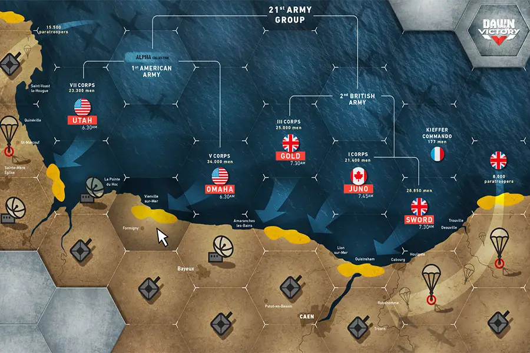

“失败只有一个答案，那就是胜利”（温斯顿·丘吉尔爵士）
Les sanglots longs
大提琴
德尔奥托姆
祝福我心
D'une langueur
单调
就在贝多芬第五交响曲的第一个音符和传说中的公式“这里是伦敦。法国人对法国人说话”之后，诗人保罗·魏尔兰的这六行在 TSF 电台产生了共鸣。
DAWN OF VICTORY 是有史以来第一个基于区块链的 NFT 收集关于二战的纸牌游戏。我们邀请您重温 1944 年 6 月 6 日这个著名的日子。区块链技术使我们能够通过在策略游戏中打牌来参与故事

