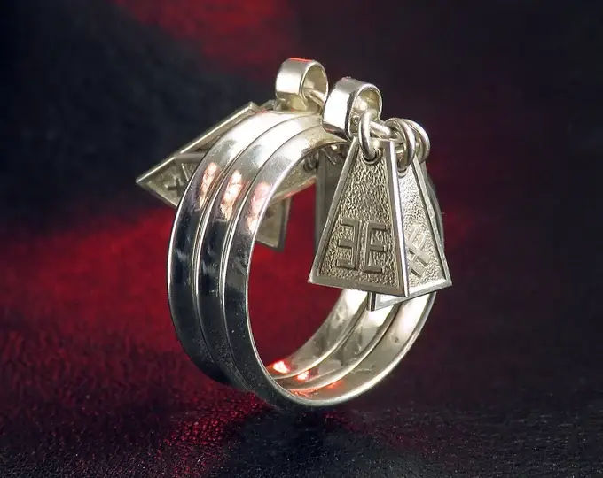

[Day] Rings 的第一轮开始于玩家将他的赌注存入空筹码。赌注必须等于或高于 1 Finney (0.001 Ether)。
从他或她的交易 - depositStack() 调用 - 在某个区块 X 中得到确认的那一刻起，这一轮将继续进行 5748 个额外的区块 - stackWait=5748 - 在此期间任何其他玩家都可以参与下注并堆叠确切的相同数量。
如果玩家尝试存入低于当前值 - stackValue - 的赌注，则该赌注将不会被添加到堆栈中，并且该值将返回给玩家。
如果玩家存入的赌注高于当前的 stackValue，则一旦将赌注添加到堆栈中，就会向玩家返还更改。
一旦第 (X+5749) 个区块被挖出，就可以宣布获胜者，调用 closeBet() 或使用 depositStack() 开始新一轮。获胜者是用户，其地址与可以下注的最后一个块之后的第一个块的块哈希连接，并通过哈希函数 keccak256 并转换为无符号值 - uint - 返回最小值，或者换句话说：
uint ( keccak256 ( abi.encodePacked ( blockhash ( stackTime + stackWait + 1 ), playerAddress )))
在所有下注的玩家的地址中滚动 playerAddress 以找到最小值。
获胜者获得 98% 的筹码。
2% 的筹码流向了房子。

