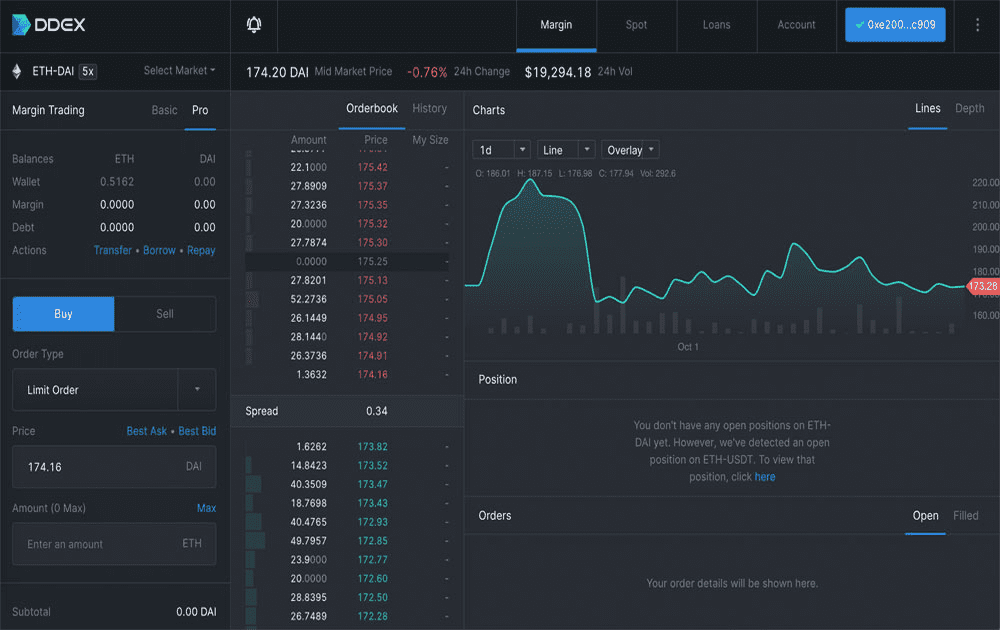

DDEX Margin 是一个去中心化的交易平台，让用户可以进行杠杆交易、借贷和产生利息。 * 按需，年化率高达 15%，ETH、USDT、DAI * 高达 5 倍杠杆，多头/空头 ETH * 智能合约由 MakerDao 的审计公司 PeckShield 审计，去中心化交易所DDEX Margin10月17号主网上线，支持保证金交易和借贷功能。DDEX表示该版本提供一站式借贷+杠杆服务，用户无需分别前往借贷平台和交易所平台。DDEX Margin将基于DDEX已有的链下订单簿，并表示提供和中心化交易所一样的现货流动性。同时， 用户可以随存随取ETH、 USDT 、DAI获得利息。区块链安全公司PeckShield将为Hydro Protocol提供DDEX Margin安全审计

。