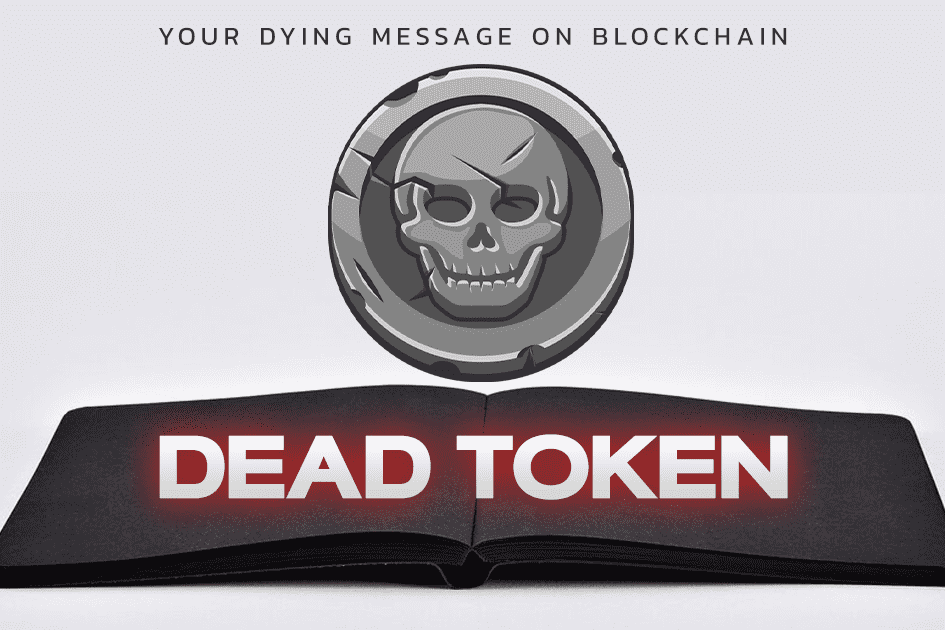

使用运行在币安智能链上的区块链技术来制定您的遗嘱/遗嘱的平台
‌
所有操作都存储在区块链上，除了您分配给的人之外，没有人可以访问您的死笔记。
‌
允许您将您的遗产交给您希望的任何人。
‌
使用 Dead Note，您可以与任何您希望通过遗嘱处理您的资产的人表达您的意图。 （无需任何法律）
‌
避免延误
‌
遗嘱 给您所爱的人一个机会 在短时间内拥有您的遗产，您可以终生修改您的遗嘱。
‌
避免争论
‌
遗嘱可以让您安心，当您不得不离开时，不会出现任何冲突。
安全
‌
所有遗嘱都在区块链上存储和加密。

