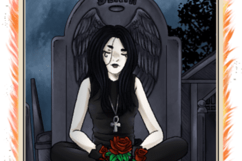

---
title: "Death"
description: "Death Farm 是第一个带有 Anti-Bot System、Vaults 和 Max-Supply、NFT Gambling 和 NFT Merge 的自动组合的单产农场"
date: 2022-08-15T00:00:00+08:00
lastmod: 2022-08-15T00:00:00+08:00
draft: false
authors: ["boogArno"]
featuredImage: "death.png"
tags: ["DeFi","Death"]
categories: ["nfts"]
nfts: ["DeFi"]
blockchain: "Polygon"
website: "https://app.death.sandman.finance/"
twitter: "https://twitter.com/Sandman_Finance"
discord: ""
telegram: ""
github: "https://github.com/sandmanfinance"
youtube: "https://www.youtube.com/channel/UCN_deX0boZPVUre-SV6aqwA"
twitch: ""
facebook: ""
instagram: ""
reddit: ""
medium: "https://sandmanfinance.medium.com/"
steam: ""
gitbook: ""
googleplay: ""
appstore: ""
status: "Live"
weight: 
lightgallery: true
toc: true
pinned: false
recommend: false
recommend1: false
---
死亡是桑德曼金融的最后一层。 DEATH 是一种带有 Anti-Bot 系统的单产农业，具有自动复合功能的 Vaults 和具有 Max-Supply 的多层，NFT Farming，NFT Battles 和 Gambling
如果您正在寻找一个安全可靠的 Yield Farm、NFT Profile、NFT Battles、NFT Farm 和 Gambling，由 Polygon Network 中的 Chainlink 提供支持，具有疯狂的 APR 和致力于增长的敬业守护团队，那么您来了到正确的地方

