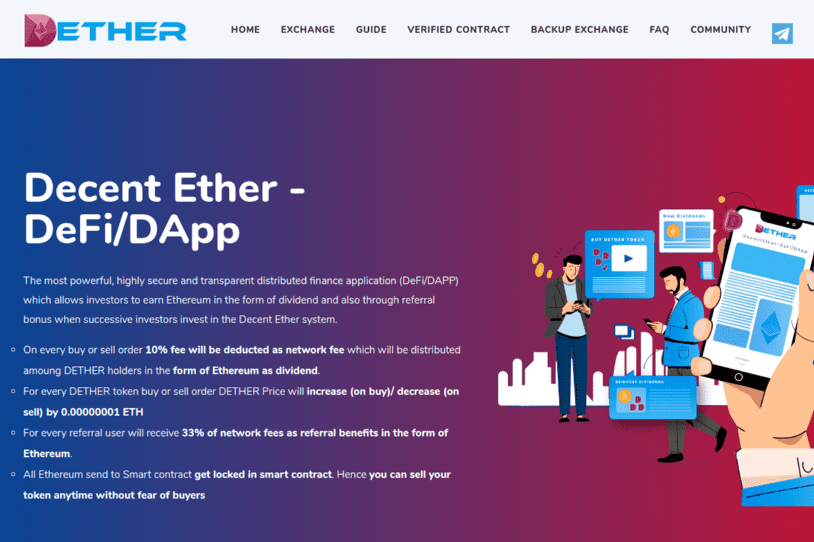

这允许投资者以股息的形式赚取以太坊，并在连续投资者投资 Decent Ether 系统时通过推荐奖金获得。

  在每笔买卖订单上，10% 的费用将作为网络费用扣除，该费用将以以太坊的形式分配给 DETHER 持有者作为股息。
  对于每个 DETHER 代币买入或卖出订单，DETHER 价格将增加（买入）/减少（卖出）0.00000001 ETH
  对于每个推荐用户，将以以太坊的形式获得 33% 的网络费用作为推荐收益。
  所有发送到智能合约的以太坊都被锁定在智能合约中。因此，您可以随时出售您的代币，而不必担心买家

