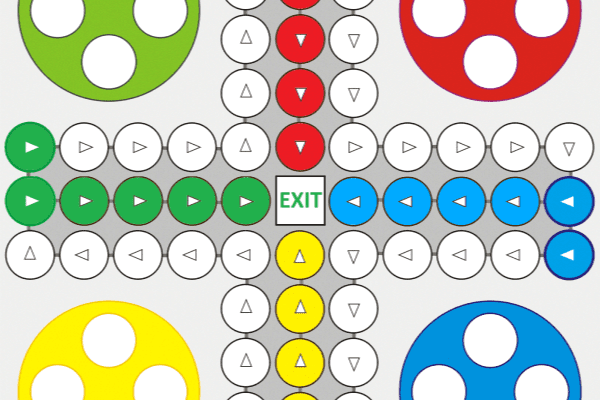

Ludo 是一款适合 2-4 人的战略棋盘游戏，每个玩家都获得四个代币或棋子。赢得游戏获得奖池奖励并为每一个棋子移动铸造 TFN

有趣的鸟
Fun Bird 是一款受 Flappy Bird 启发的游戏。玩和挖掘 $TFN。获得前 20 名玩家的每日额外奖金。您也可以与其他玩家玩 1 VS 1

卢多
Ludo 是一款适合 2-4 人的战略棋盘游戏，每个玩家都获得四个代币或棋子。通过玩 LUDO 获得 TFN

