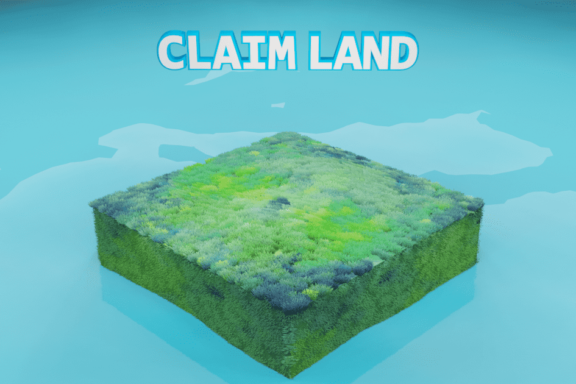

Decentribes 是一款即将推出的 Play to Earn Massive Multiplayer Online 游戏，玩家在区块链上拥有土地和物品。
游戏将在浏览器中实时进行，每个玩家都可以创建一个头像并访问任何一块土地 - 单独或与朋友一起。
土地所有者将能够收获资源，这些资源将从他们精心培育的土壤中生长出来。
然后，这些资源可用于制作新的、令人兴奋的物品以进行独特的定制，或铸造到区块链上并公开交易。
1000 Land 现在可以在特殊的“Founders Planet”上使用，并且可以领取。
Founders Land 所有者将获得独特的奖励，包括 5% 的资源增长、游戏内物品掉落、即将到来的 Decentribes 代币的空投等等。

