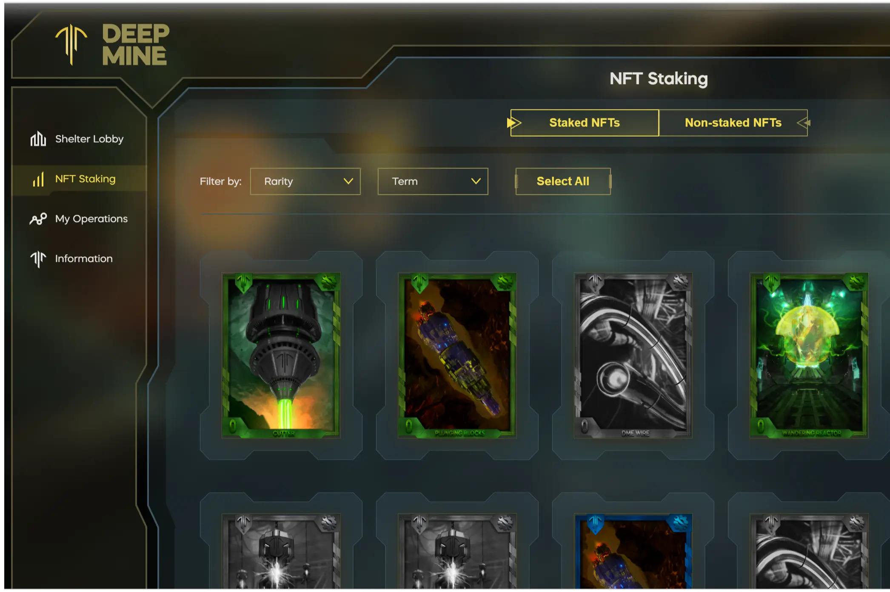

DeepMine 是一款 Play-2-Earn NFT Sci-Fi Metaverse 游戏，具有复杂且多样化的经济性，游戏玩法激发玩家相互合作和互动。游戏的巅峰是一种经济模型，意味着玩家之间持续进行资产和服务交易，刺激游戏内资产和代币的流动性。
该项目建立在 WAX 区块链上，资产在 AtomicHub 和内部市场上交易。该项目已经为第一批 NFT 投币参与者启动了 NFT 质押门户，他们可以在其中获得 DeepMine 治理令牌的奖励。拍卖和内部商店等其他预发布功能已完成，将在 TGE 和第二次 NFT 下降后立即启动。
游戏设定在科幻元宇宙中，事件发生在遥远的未来以利亚撒星球上，人类濒临灭绝。没有星星可以提供能量，所以玩家的目标是到达以 DME（DeepMine Energy 代币）形式发射能量的星球核心。
具有多个变量的复杂游戏经济允许在 DeepMine 上构建伴随项目，将游戏演变为适当的元宇宙体验。

