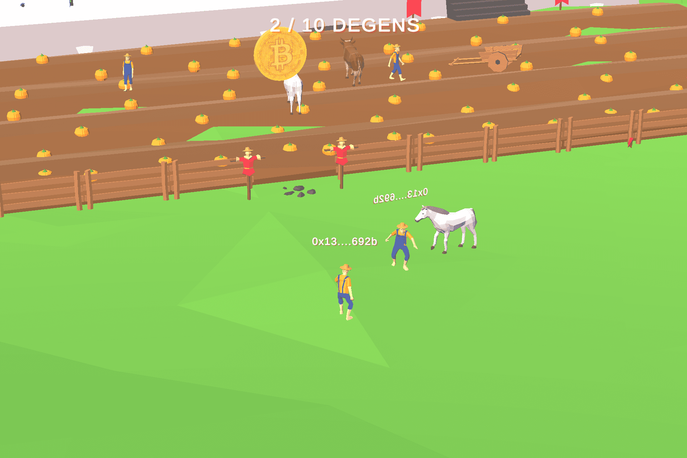

Defi Degen Land 是独特的下一代元界。

  游戏化 DeFi
  在游戏中收获待定奖励
  拥有游戏内物品的所有权
  玩奖励（如鱿鱼游戏）

目标是让 DeFi 真棒！

区块链、加密、NFT、元界、去中心化金融——这些技术近年来越来越受欢迎，因为它们有能力和潜力改变我们与世界互动的方式。随着这些新技术的进一步实施，过时的系统开始崩溃。

在本文中，我们将重点关注 DeFi 或去中心化金融及其在元宇宙中的作用。

