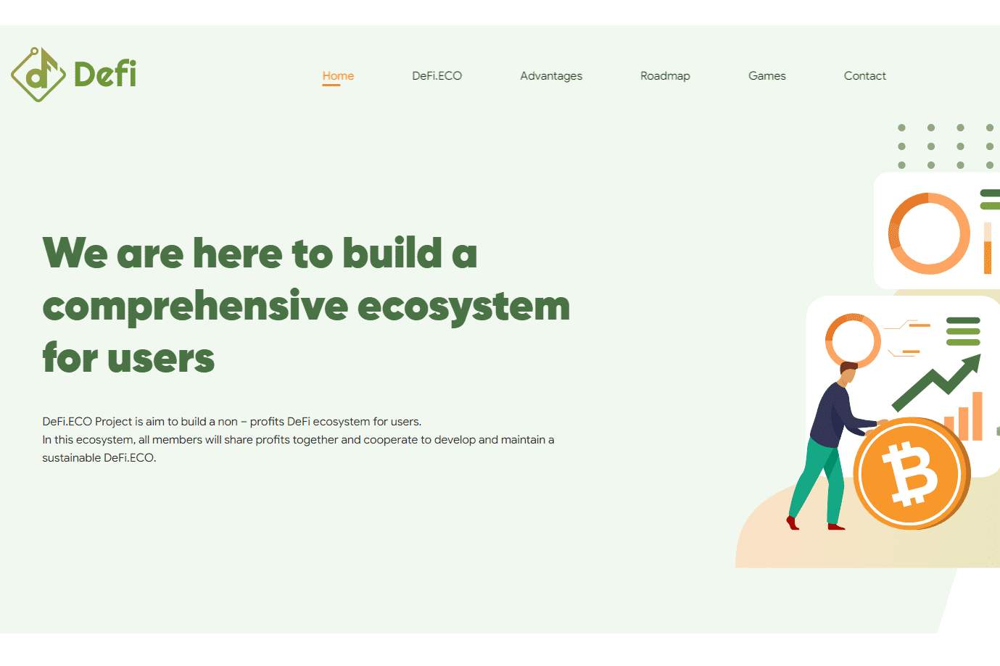

---
title: "DeFi.ECO"
description: "设计你的生活"
date: 2022-08-16T00:00:00+08:00
lastmod: 2022-08-16T00:00:00+08:00
draft: false
authors: ["boogArno"]
featuredImage: "defi-eco.png"
tags: ["Other","DeFi.ECO"]
categories: ["nfts"]
nfts: ["Other"]
blockchain: "TRON"
website: "https://defi.eco/"
twitter: ""
discord: ""
telegram: ""
github: ""
youtube: ""
twitch: ""
facebook: ""
instagram: ""
reddit: ""
medium: "https://medium.com/defi-ecosystem"
steam: ""
gitbook: ""
googleplay: ""
appstore: ""
status: "Live"
weight: 
lightgallery: true
toc: true
pinned: false
recommend: false
recommend1: false
---
DeFi.ECO 项目旨在为用户构建一个非盈利的 DeFi 生态系统。在这个生态系统中，所有成员将共同分享利润，合作开发和维护一个可持续发展的 DeFi.ECO。
我们将 DeFi.ECO 构建为一个金融游戏，每个人都可以在其中分享利润并从我们的游戏中获得更高的回报。在没有中介的情况下，用户可以完全控制他们的资产。