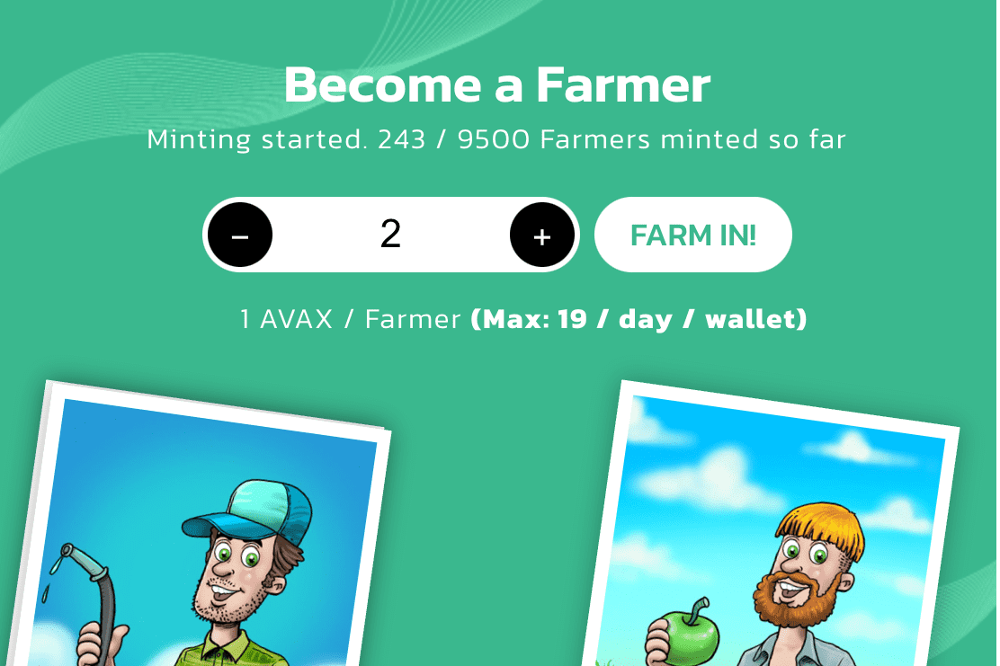

DeFi Farmers 由居住在 Avalanche 网络上的 9,500 名随机生成的生态友好型 NFT Farmers 组成。每个 DeFi Farmer 都是一个 NFT，代表“Ecoverse”中的一个化身。
通过持有 DeFi Farmer，您可以获得铸币费奖励和未来销售的版税
DeFi Farmers 有各种不同的颜色、服装和面孔，但没有两个 Farmers 是一样的。每个农民都带来了自己的风格，拥有来自总共 57 种不同属性的独特帽子、头发、衣服和农具！
DeFi Farmers 是由环保 DeFi 协议 Treedefi 创建的衍生项目。通过持有 DeFi Farmer，您可以优先使用最重要的 Treedefi 功能。 Treedefi 允许投资者对现实世界产生影响，并为他们提供通过 NFTrees 抵消其二氧化碳足迹的机会，NFTrees 是由世界各地真实种植的树木支持的 NFT。

