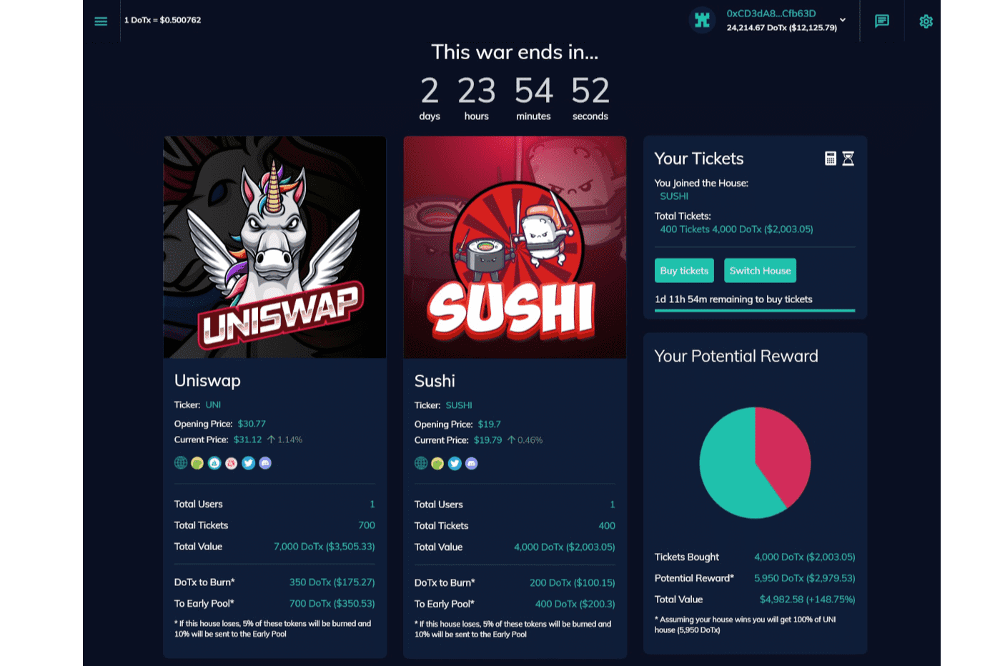

---
title: "DeFi of Thrones"
description: "DeFi of Thrones ($DoTx) 是一个市场预测平台 - 它允许您投注您最喜欢的加密项目。"
date: 2022-08-16T00:00:00+08:00
lastmod: 2022-08-16T00:00:00+08:00
draft: false
authors: ["boogArno"]
featuredImage: "defi-of-thrones.png"
tags: ["NFT Games","DeFi of Thrones"]
categories: ["nfts"]
nfts: ["NFT Games"]
blockchain: "Polygon"
website: "https://defiofthrones.io/"
twitter: "https://twitter.com/DefiOfThrones"
discord: "https://discord.com/invite/FhTt85c"
telegram: ""
github: ""
youtube: ""
twitch: ""
facebook: "https://www.facebook.com/DefiOfThrones"
instagram: ""
reddit: ""
medium: "https://medium.com/@defiofthrones"
steam: ""
gitbook: ""
googleplay: ""
appstore: ""
status: "Live"
weight: 
lightgallery: true
toc: true
pinned: false
recommend: false
recommend1: false
---
DeFi Of Thrones（DoTx）旨在通过跟踪和收集来自 DeFi 生态系统的价格数据并为用户提供赌博的可能性，成为预测市场平台。每周都会有 2 个 DeFi 代币或硬币进行战争。一个选择你的“房子”的机会，意思是你认为表现最好的代币/硬币。在一周结束时，投注表现最好的硬币的玩家将获得 DoTx 奖励。我们致力于通过游戏化功能将预测市场提升到一个新的水平。我们计划在 3 项主要技术上构建平台：使用 DApp 技术部署以太坊 ERC-20 代币、基于 ChainLink 协议预言机和应用程序编程接口 (API)，以确保 DoTx 项目具有高度的可信任性、透明度和去中心化。

