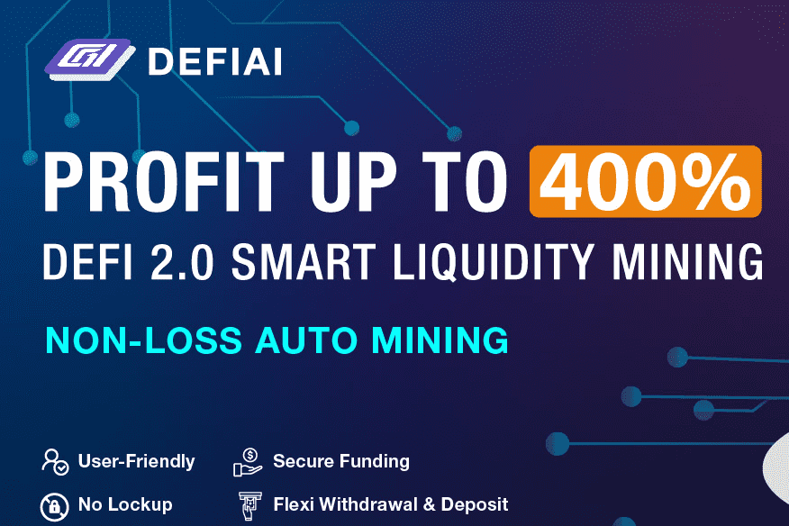

DEFIAI是一个去中心化、多策略、高收益的聚合器，可以帮助用户智能完成DeFi借贷，杠杆挖矿，不时捕获高收益矿池，自动完成复利，产生超高收益。 DeFiAi 作为一种去中心化金融协议而构建，最近已成为世界上第一个 Ai 去中心化交易所（DEX）。 DEFIAI团队将发布一系列信用认证数据服务产品。此外，这些产品都是基于底层区块链合作伙伴的支持。同时增加现有衍生品的区块链参数目标。 DEFIAI 社区将利用这些信用数据在衍生品和衍生品的基础上设计新的 DeFi 产品。 DEFIAI平台利用AI智能系统筛选出安全稳定的经过安全审计机构审计的DeFi矿池。