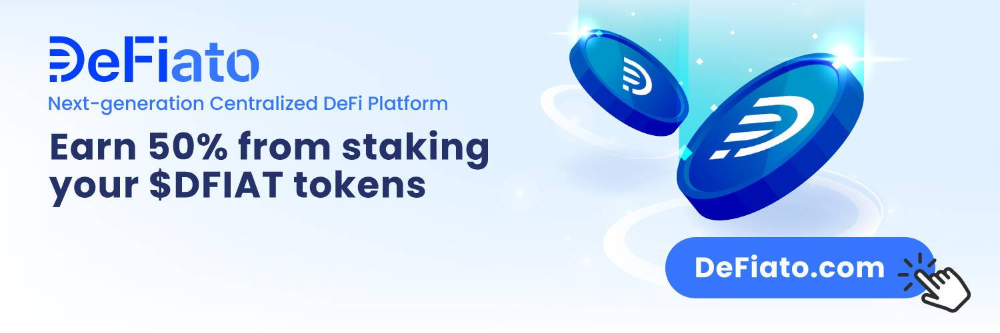

DeFiato 是用于 DeFi 质押、收益农业和金融服务的下一代集中式平台。从一开始，我们的创始使命就是消除技术壁垒，为主流普通用户提供与经验丰富的大型加密玩家一样的能力，以支持他们最喜欢的区块链项目，同时获得奖励。

质押和收益农业是最大化您的加密资产的好方法，否则这些资产会在您的账户中闲置。要开始赚钱，只需将您的加密货币存入您选择的池中。看着你的加密资产增加，并通过复合这些未来的奖励来进一步增加它们！