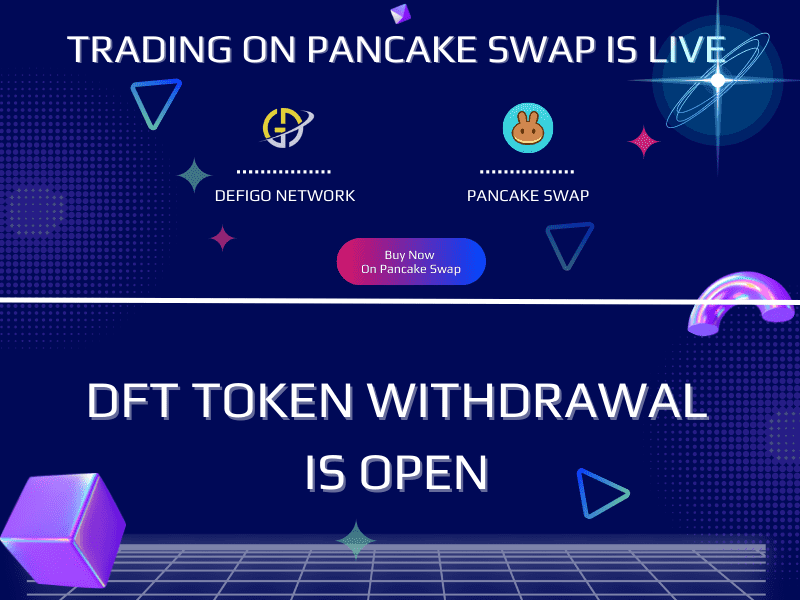

关于项目 DEFIGO WALLET DEFIDEX SWAP FALCON LAUNCHPAD DEFIGO FARM NFT MARKETPLACE DEFIGO MERCH
DEFIGO NETWORK 是一个由 6 种产品组成的生态系统，其中包括：
钱包，您可以在其中在区块链之间交换资产或简单地存储您的资金
跨链交换，您可以在其中交换资产并赚取被动收入
Launchpad 为预售项目提供投资者保护
每个会员每天可以赚取 10 种不同硬币的被动收入的平台
买卖各种 NFT 的自由市场
DEFIGO NETWORK的各种商品的品牌商店，送货到70多个国家

