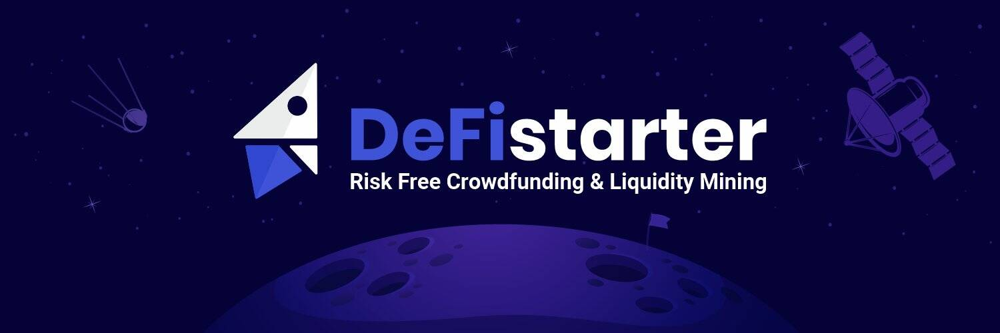

DeFiStarter 提供了一种<strong>将农民的风险降低到零</strong>的方法，并允许初创公司在不直接出售其代币的情况下筹集资金。出于这些目的，安全池提供算法 (SPO) 开始行动并确保<strong>零风险收益农业！</strong>

  
SPO 的所有参与者都可以在不直接购买的情况下获得初创公司的代币，所需要的只是在流动性池中提供可靠且经过验证的代币。这意味着 - 没有地毯拉

