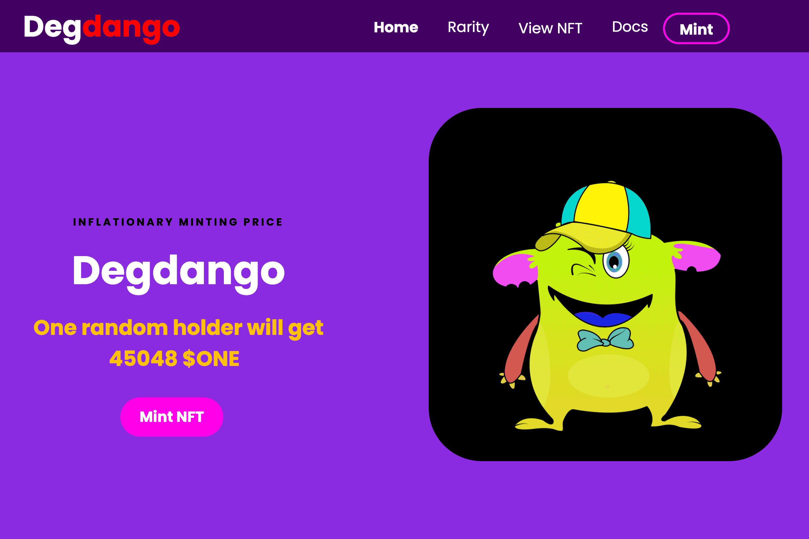

Degdango 是第一个在 Harmony 区块链上使用 Tokenomics 的 NFT 项目。
Degdangos是富裕的血统，除了非常可爱和具有令人敬畏的稀有特征可以交易之外，它们还具有特殊的能力。每次 Degdango 在铸币 dApp 上铸币时，都会发生一些特别的事情！所有 Degdangos 完全不同，具有稀有属性。它是 2851 个独特生成的 NFT 的集合，生活在 Harmony 区块链上（即将推出跨链）。
为持有者提供被动收入的 NFT 集合。
仅在 Harmony 生态系统上唯一的通胀铸币价格 NFT 集合。铸造价格从 10 美元起。

