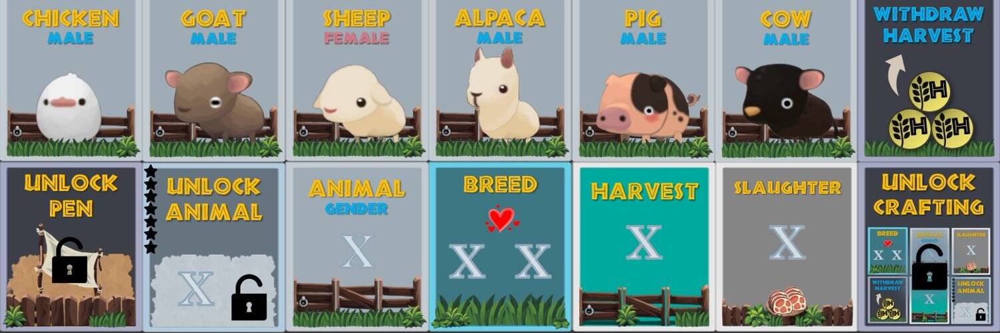

在这个游戏中，你的目标是发展和建立一个充满动物的农场。
这样做的方法是使用可以在 OpenSea 上制作或购买的 NFT 操作卡。
您可以繁殖、屠宰和收获您的动物以赚取 $HARVEST 代币。
访问该网站以获取有关如何玩的更多信息！

您农场围栏中的动物会产生产量。

使用 NFT 动作卡在您的农场围栏中屠宰或收获动物。

您还可以出售您在 OpenSea 上制作的任何 NFT 并赚取收益。

