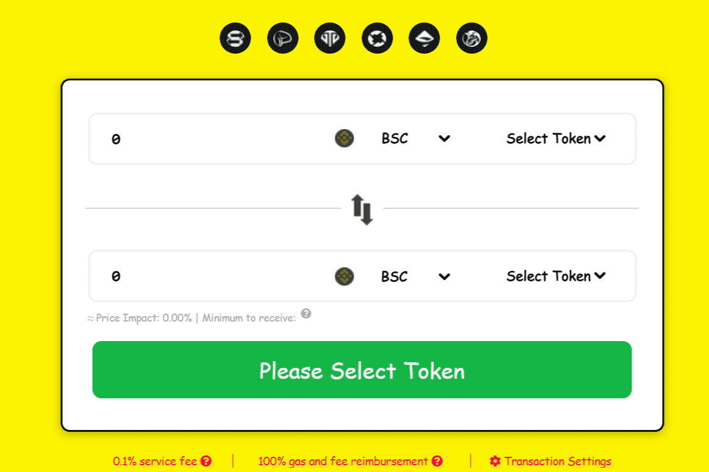

DEGEN 平台是一个与区块链无关的跨链聚合器，它从整个 DeFi 生态系统的多个区块链和 DEX 中获取流动性，无论区块链如何。因此，该平台允许用户一键获得最优惠的交易价格。
集成的前两个区块链将是币安智能链（BSC）和以太坊（ETH）。将根据需求或合作伙伴关系添加更多区块链。
目前，区块链流动性被锁定在特定的区块链上，为用户在交易他们最喜欢的代币或流行的新 AMM / DEX 时设置障碍。在加密货币中，用户应该有选择权。
DEGEN 为用户提供一键式功能，通过完全与区块链无关的方法在 DEX 之间交换他们的流动性

