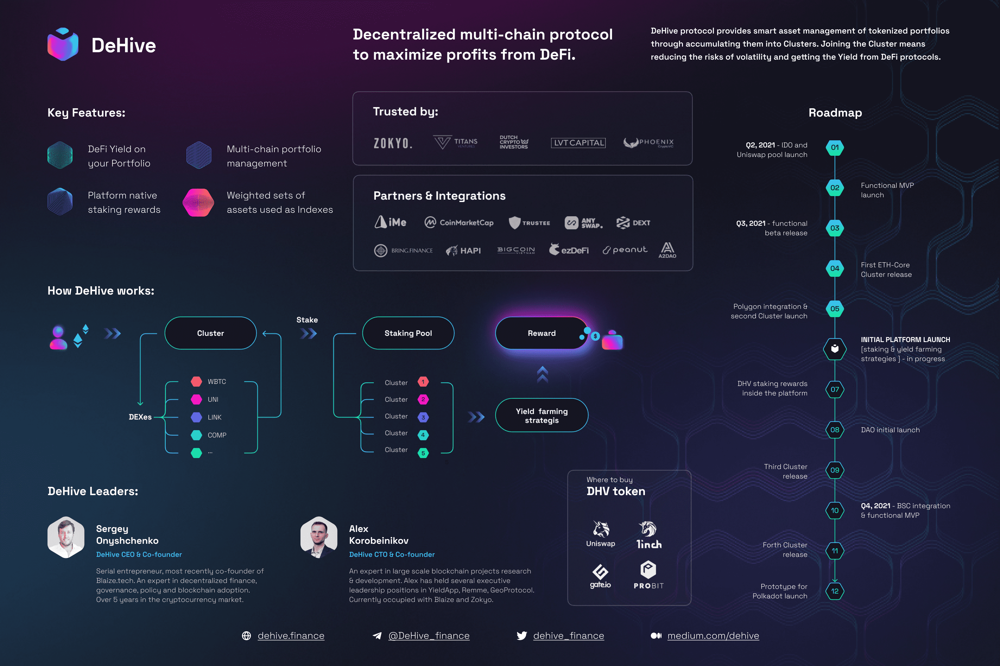

DeHive 是一种多链资产管理协议，可提供代币化投资组合的智能资产管理。 DeHive 去中心化协议通过将它们累积到集群中来提供顶级的 DeFi 资产管理。因此，它有助于扩大利润，同时将损失风险降至最低。

资产组合并由一个集群或不同集群表示，反映不同细分市场的状态。该集群可以被视为一个包含领先 DeFi 资产的指数，这些资产通常作为加密市场经济健康状况的基准。因此，这样的集群可以看作是市场评估和合理的 DeFi 投资组合管理的工具。

