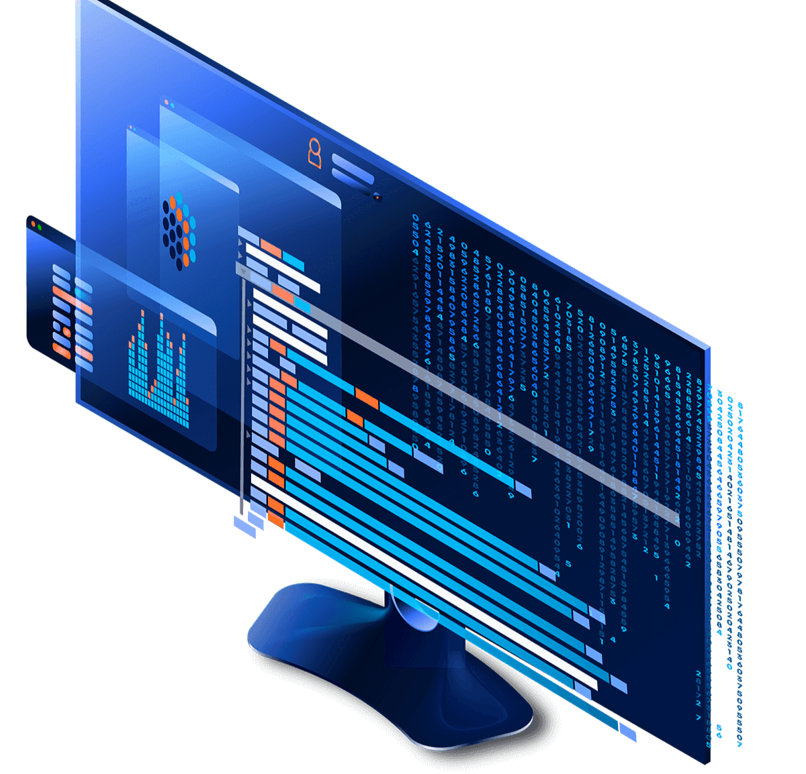

“混合智能”是一种大数据技术，能够实时跟踪所有 CEX 经纪商和 1400 多个活跃交易对。 HI 在不受我们控制的情况下发现最好的数字资产进行交易。我们的软件允许我们同时运行超过 1000 种策略。

我们提供符合 GDPR 的数据经济解决方案，让您可以消费和提供数据服务，同时保持对 IP 和敏感数据的控制，从而满足 GDPR 和 IT 安全要求。

计算到数据徽标
计算到数据
提供计算访问权限而不泄露您的数据内容
在保护资产隐私的同时将您的数据货币化
权力下放标志
权力下放
通过分布式账本技术 (DLT) 没有单点故障
自动审计跟踪，实现完全透明
互操作性徽标
互操作性
由于联合架构，没有锁定效应
包括来自各种来源的数据服务
机器学习徽标
机器学习
在您的门户中集成外部 ML 专业知识
使用最先进的 ML 算法分析数据
保持对 IP 和敏感数据的完全控制

