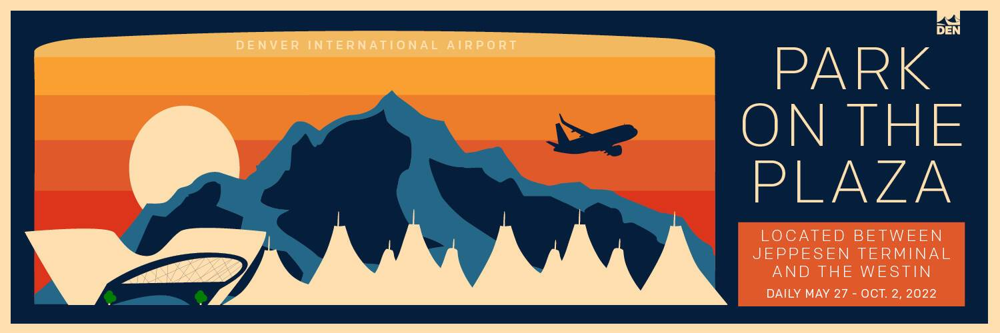

Den.social 是一个基于区块链的社交媒体平台，建立在 Dragonchain 的混合区块链平台之上，社区多元化，无传统广告。该平台支持内容创建者、参与者、评估者和消费者的自治和基于预测的市场，而不会被算法排除在外。它具有强大的反审查能力、基于区块链的证明报告和现代代币化的内部经济，允许更平等和公平地分配价值。每个动作的证明报告（帖子、投票、评论、编辑等）都分散到比特币、以太坊经典和以太坊。

