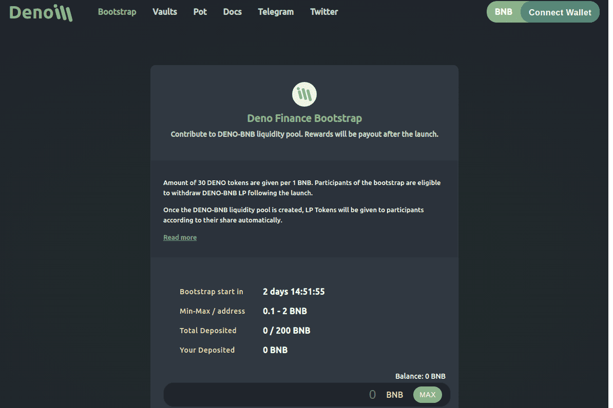

我们的 Deno 团队致力于通过 Deno 智能合约生态系统为用户提供安全和创新的环境来稳定农场并自动复合其收益，从而支持底层的 Defi 生态系统。
我们是第一个实施动态扩张和自动流动性机制以稳定增加市值并防止市场操纵的协议。 Deno 旨在维持社区驱动的代币意义价格。这意味着价格用于计算用于扩展的 DENO 代币数量。
Deno 将通过完全由社区驱动的公平启动来启动。我们为投资者提供了一种将资金质押以创造流动性的方式。这意味着在发布时没有为任何人铸造 DENO 代币。

