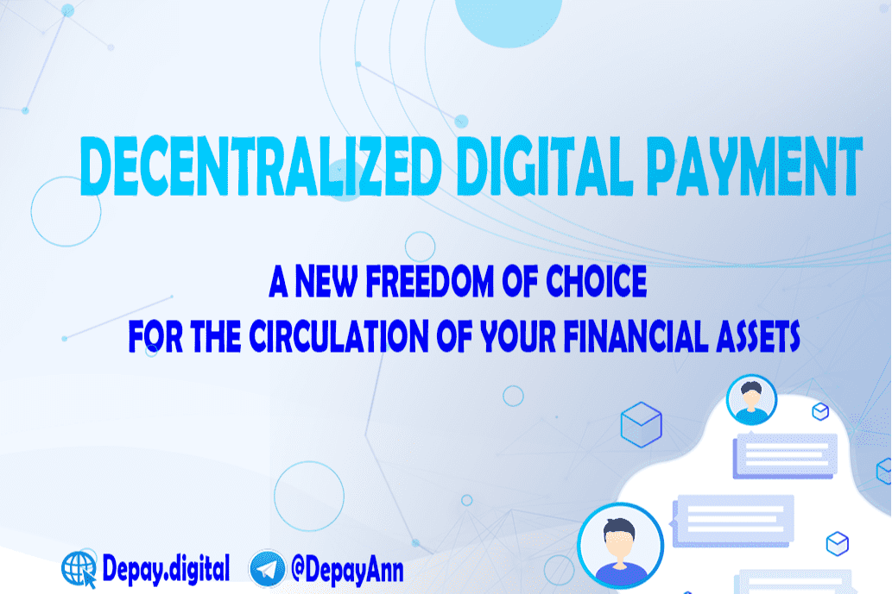

🔥欢迎来到 DePay - 去中心化数字支付
为您的金融资产流通提供新的选择自由。
什么是DePay？
去中心化数字支付为未来的金融服务和数字银行开发了下一代模型。
该模型使用区块链技术以及智能手机和新的生物识别系统，该系统将用于为每个用户提供安全可靠的帐户。
这是一个开发加密金融世界未来的项目。其主要目标是将 DePay 代币集成和连接到传统金融世界，并通过 DePay 平台为用户、交易者、投资者和金融机构创建一个单一的网关，并提供一系列附加服务。
DePay 生态系统？
然后，用户将可以访问我们的小额信贷服务，以在他们的账户上获得透支。结果是客户只需在手机上单击一下即可管理各种复杂的银行和支付服务。另一方面，DePay 生态系统中的商家将有兴趣通过 DePay 应用程序接受付款。

  钱包 - P2P、B2B 加密货币交易所、转账
  支付和转账——汇款和跨境支付
  货币兑换
  返现金
  支付卡
  贷款/借记
  即时借贷
  使用 DePay 独特的借贷算法的小额信贷

DePay 代币经济学？
DPAY 代币将推动去中心化数字支付引擎，并作为一种新型货币在加密货币和现实世界之间进行调解。

  总供应量

100,000,000 DPAY

  预售和 IDO/IEO

60,000,000 DPAY

  质押池

20,000,000 DPAY

  营销

15,000,000 DPAY

  团队

5,000,000 DPAY

