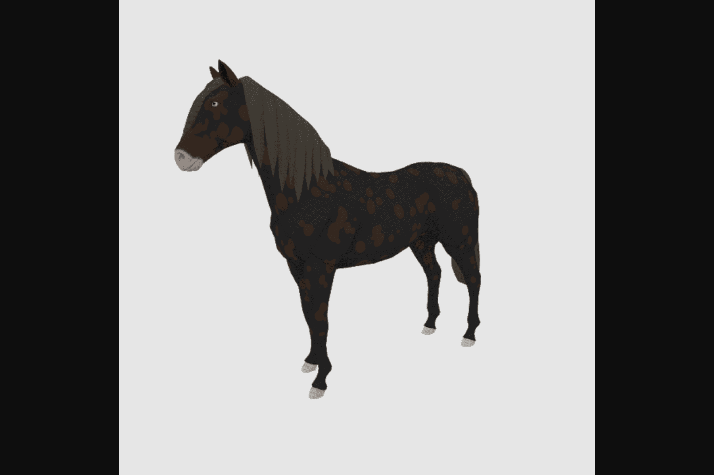

DeRace 是一个完整的 NFT 赛马生态系统，您可以在其中参与赛马，培育具有独特特征的 NFT 马匹，在自己的 NFT 赛马场举办比赛，并在此过程中赚取利润。
DeRace 通过允许玩家与其富含 DNA 的 NFT 马完全互动并完全控制自己的赛马场，从而使当前的 NFT 市场充满活力。

DeRace 是一个完整的 NFT 赛马虚拟世界，您可以在其中参加赛马、培育具有独特特征的 NFT 马、建立自己的 NFT 赛马场并通过我们可持续的 P2E 机制获得奖励，同时进行所有这些操作。

