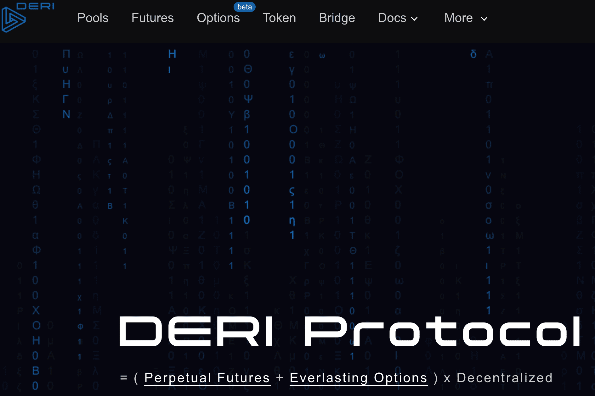

德里，你的选择，你的未来！
Deri 协议是交易衍生品的 DeFi 方式：对冲、投机、套利，一切都在链上。使用 Deri 协议，交易在 AMM 范式下执行，头寸被标记为 NFT，可与其他 DeFi 项目高度组合。 Deri 协议提供了一种链上机制来精确和高效地交换风险敞口，铸造了 DeFi 基础设施中最重要的区块之一。
自上线以来，Deri Protocol 经历了两次大版本迭代，一直支持三大衍生品类型：永续合约、永续期权和电力永续合约。截至目前，它已部署在多个区块链网络上，服务于交易者的对冲和投机需求，处理的总交易量超过200亿美元。统计数据显示，Deri 协议已成为每笔交易量使用最多的 DeFi 衍生协议之一。

