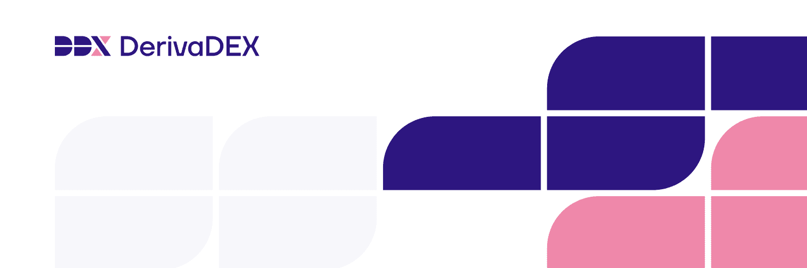

DerivaDEX 是下一代加密货币衍生品。通过引导保险基金开始赚取 DDX。

DerivaDEX是一种新型的交易协议，具有关键的性能优势，包括实时报价，快速的交易清结算和具有竞争力的费用结构。

DerivaDEX成立第一天起就是DAO。交易者和代币持有者控制该平台。用户对与交易有关的功能进行投票。

DDX是DerivaDEX的本地令牌。 DDX通过DerivaDAO来管理项目。 DDX还用于减少费用和争取优惠等。

保险挖矿为保险基金筹集资金。用户向保险基金注资，并获得DDX。保险基金提供了世界一流的交易经验。

