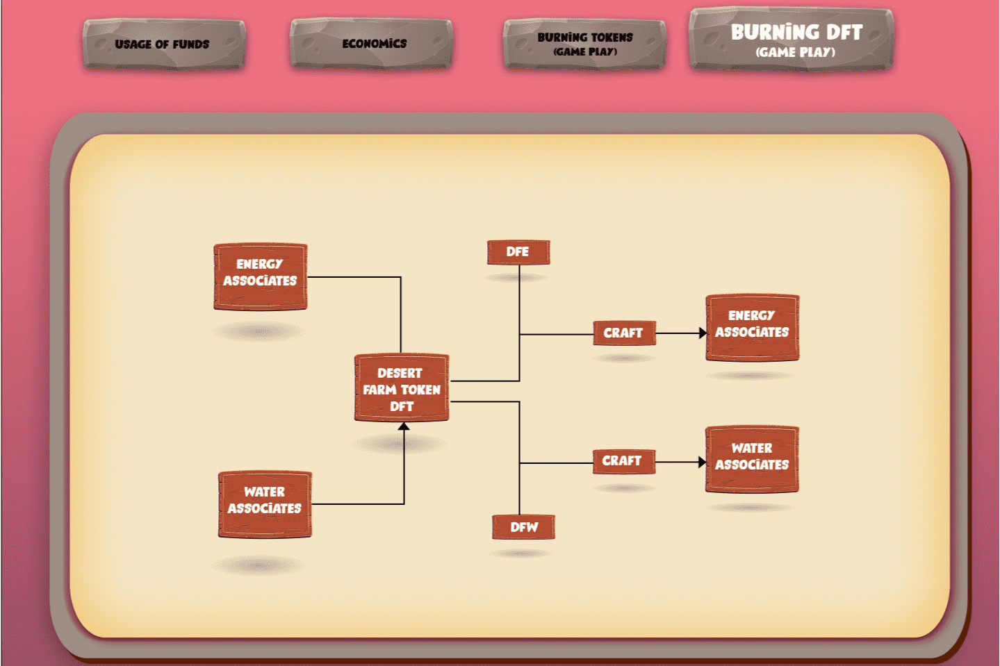

Desert Farm Game是一款基于Wax区块链的NFT游戏，
制作成本增量：
他们增加了每次制作的制作成本，这将燃烧多余的代币并让玩家拥有稳定的经济。
内置游戏交换：
DFARM是沙漠农场游戏的原生代币；他们稍后将拥有一个内置交易所，用于在游戏内交易代币。此外，您可以使用 DFARM 在内置交易所中交易其他代币。
减少挖矿时间/一键挖矿：
如果您是高级会员，则需要每 24 小时挖掘一次，每天只需点击一次。
种子掉落：
对于农业，我们将通过 Seeds Drop 仅提供种子。你需要水和能量来将它们制作成工具。食物代币发布后，沙漠农场游戏将允许使用任何代币开采另一个代币
升级：
低稀有度的矿机可以通过升级升级为高稀有度，升级不收取任何费用。

