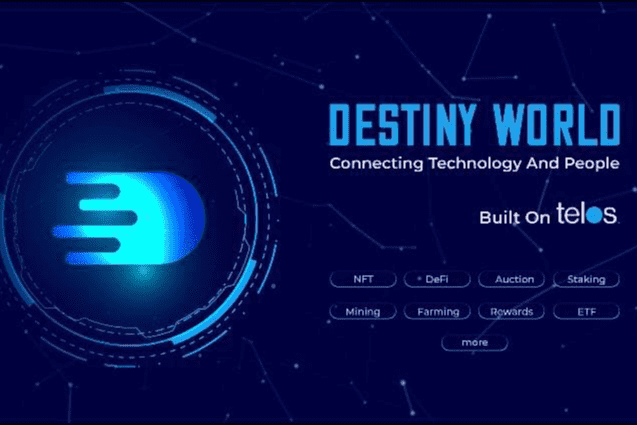

Destiny World 基于一个简单的想法，即在多个层面连接人和技术，结合趋势并重用已经开发和工作的东西。我们坚信，将所有这些放在一个简单的用户体验中，将产生对成功非常重要的轨迹和网络效应。

拍卖
与我们的经济相关的代币的出价和质押

在各种平台上使用 Destiny Coin 或 Stake 赚取红利和 APR

挖掘我们的 REES 代币并访问现实生活中的用例，例如信用卡、稳定币和金融工具

