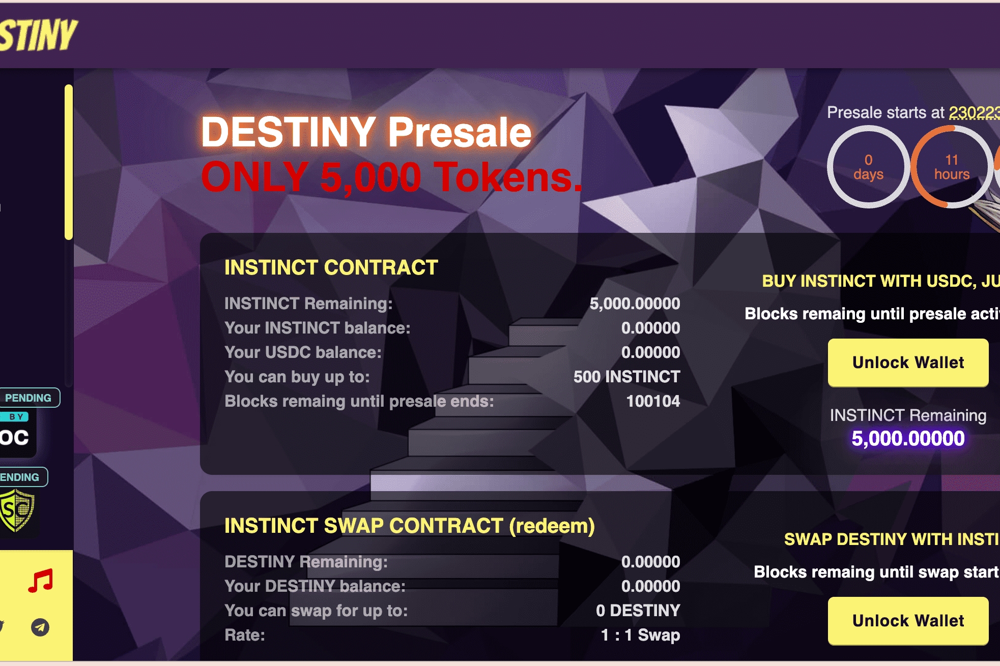

Destiny 是 Sandman Finance 的第 6 层，是具有 Anti-Bot 系统的收益农业、具有自动复合的保险库和具有 Max-Supply、NFT 农业、NFT 战斗和赌博的多层
如果你正在寻找一个安全可靠的 Yield Farm、NFT Profile、NFT Battles、NFT Farm 和 Gambling，由 Polygon Network 中的 Chainlink 提供支持，具有疯狂的 APR 和致力于增长的敬业守卫团队，那么你来了到正确的地方

