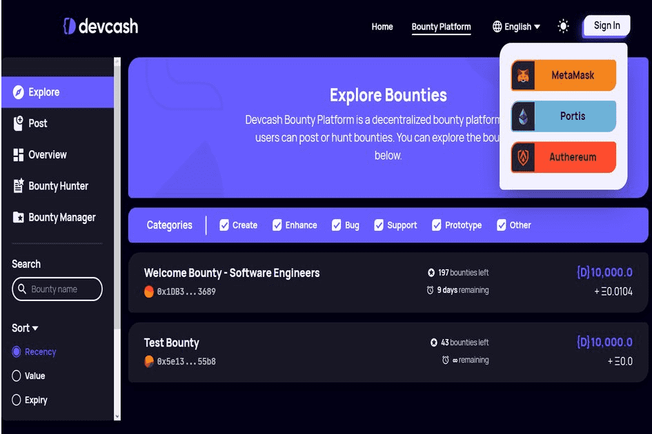

Devcash 赏金平台是一个去中心化的赏金平台，用户利用 DEV 众包开发者人才或执行开发者任务并赚取 DEV。

Blockchain Developers United 是一个开发者经济平台，结合了线下和在线聚会、论坛活动、赏金和复活节彩蛋，由 Devcash 提供支持。 Devcash 是开发者经济的现金，是 Blockchain Developers United 的官方货币。 Devcash 和 Devcash 平台提供各种服务，例如赏金平台和去中心化交易所，以使开发人员的工作更轻松、更高效。 Devcash 赏金平台是一个去中心化平台，用户利用 Devcash 众包开发人员人才或执行任务并赚取 Devcash。用户可以发布和/或寻找赏金。

