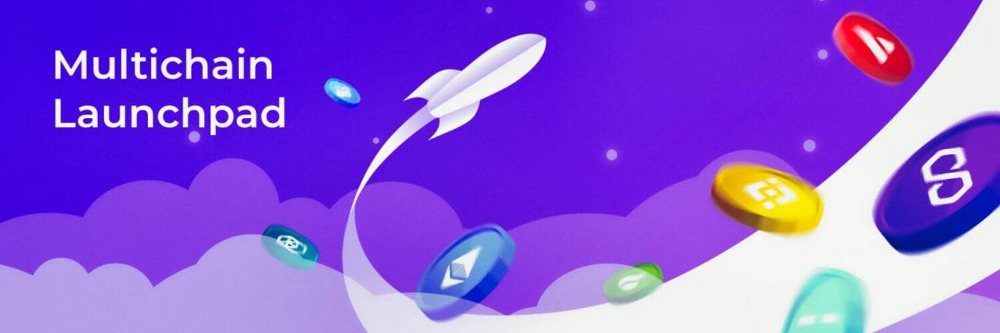

DexPad 平台为任何寻找铸造和锁定代币、通过预售筹集资金和空投代币等服务的人提供了一个完整的解决方案。

exPad 允许任何人无缝地铸造、空投、启动和锁定他们的代币，而无需任何编码！

DexPad 平台为任何寻找铸造和锁定代币、通过预售筹集资金和空投代币等服务的人提供了一个完整的解决方案。
我们的平台正在使用治理协议来确定对代币的审计。可以出于各种原因使用提案，例如设置费用、添加安全审计员以及决定进一步的开发和功能。

