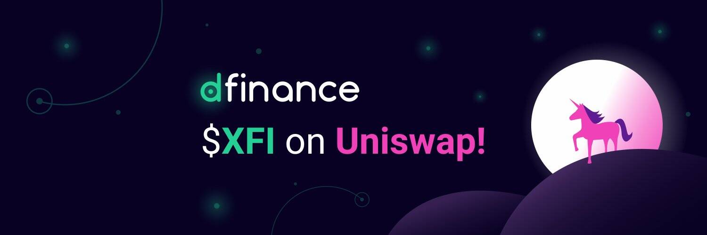

让我们D！币安智能链上排名第一的 AMM 和收益农场。

Dfinance 使您能够使用自然语言工具创建和交易您自己的基于区块链的金融工具。

集成
Dfinance 与许多平台合作伙伴集成，使您能够创建通用金融工具，从 DeFi 到代币化的现实世界资产。

贸易
Dfinance DEX 使您能够为您创建的资产建立市场并访问社区创建的资产。

建造
使用 Dfinance 的强大功能和 Move 语言的稳健性来创建低级模块，以构建您可以想象的任何工具。

