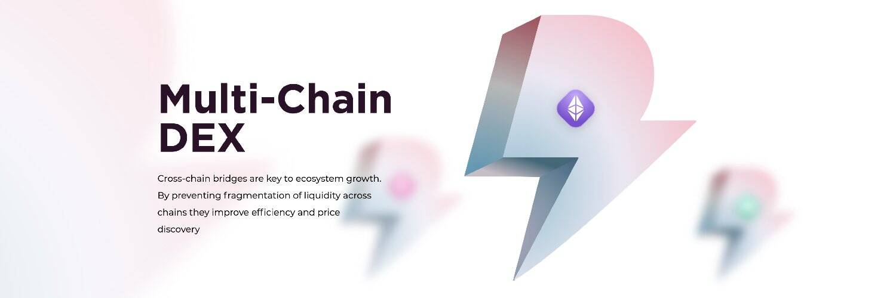

Dfyn 是目前在 Polygon 网络上运行的多链 AMM DEX。各种链上的 Dfyn 节点充当由路由器协议启用的跨链流动性超级网格的流动性入口和出口点。

跨链桥梁是生态系统增长的关键。通过防止跨链流动性分散，它们提高了效率和价格发现
Dfyn 的第 2 层技术启动板将允许创建者在多个链上启动他们的代币，在没有代码工具的情况下启动农业游戏和归属，在 Dfyn 上质押合约并在没有高额 ETH 费用的情况下实施创造性设计的第 2 层 IDO 策略。

Dfyn Noderunner：现在在你的链上启动 Dfyn
Dfyn 的节点运行平台将使区块链布道者能够在区块链上运行自己的 Dfyn 节点，以通过收费获得被动收入。

