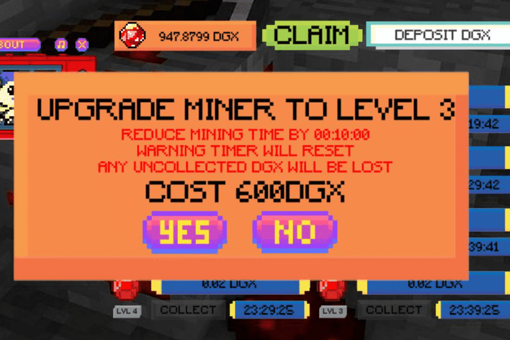

DGX Mining 是一款在币安智能链上创建的闲置农场游戏。

一旦计时器达到零，玩家将能够通过单击收集按钮来投资矿工收集器以赚取被动收入。

盒子里的 AI 数据中心
数据科学团队处于创新的前沿，但他们经常需要寻找可用的 AI 计算周期来完成项目。他们需要一种可以在任何地方插入并为世界上任何地方的多个同时用户提供最佳性能的专用资源。 NVIDIA DGX Station™ A100 为数据科学团队带来 AI 超级计算，提供无需数据中心或额外 IT 基础设施的数据中心技术。强大的性能、完全优化的软件堆栈以及对 NVIDIA DGXperts 的直接访问可确保更快地获得洞察力。

