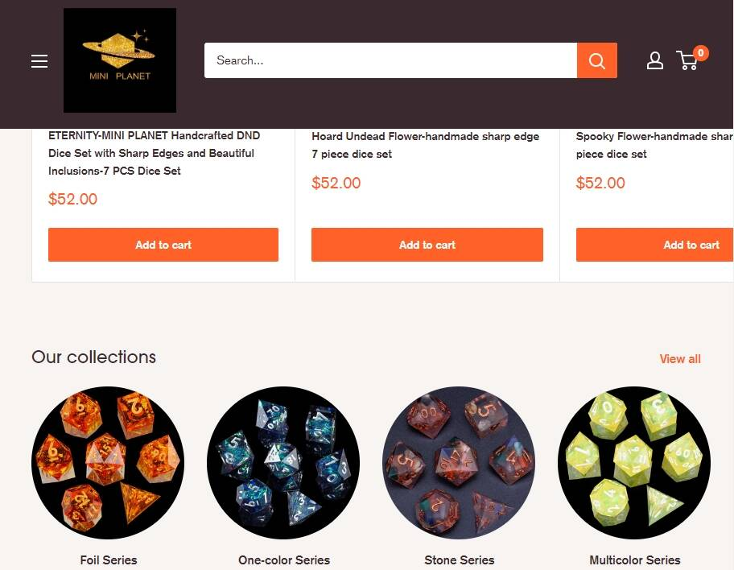

骰子星球是一款链上骰子游戏。 Dice Planet 基于 ThunderCore 上的随机数生成器，完全建立在链上。完全公平和有趣。

我们是 Mini Planet Dice，我们很高兴推出我们的第一个 Kickstarter，用于我们最新的手工锐边骰子系列，灵感来自上面的星星，价格实惠。每一套都是在我们的制造工厂手工制作，手工抛光和上墨，由我们的树脂艺术家团队进行质量控制，并运送到我们在美国的团队再次进行质量控制。这些骰子每个都将附带一个与其相应套装相匹配的免费美丽骰子盒！ 

