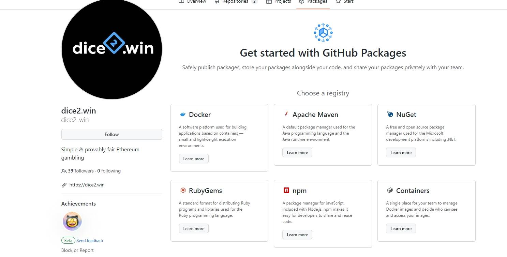

可证明公平的骰子，赌场优势低 1%，周转速度快，无需注册 &amp;存款和一流的 RNG 用于高风险。头奖也是！

简单且可证明公平的以太坊赌博

Solidity，面向合约的编程语言

用于构建基于容器的应用程序的软件平台——小型轻量级执行环境。

*骰子2*。*win*在这方面做得很好，以一种足够引人注目的方式展示了骰子和其他类似类型的可证明公平的条目，从而产生了超过 40,000 个...

